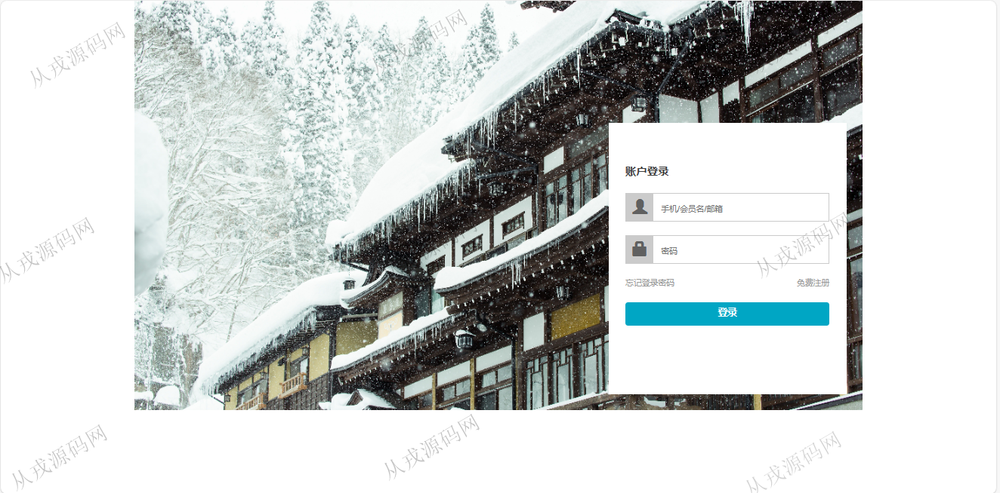
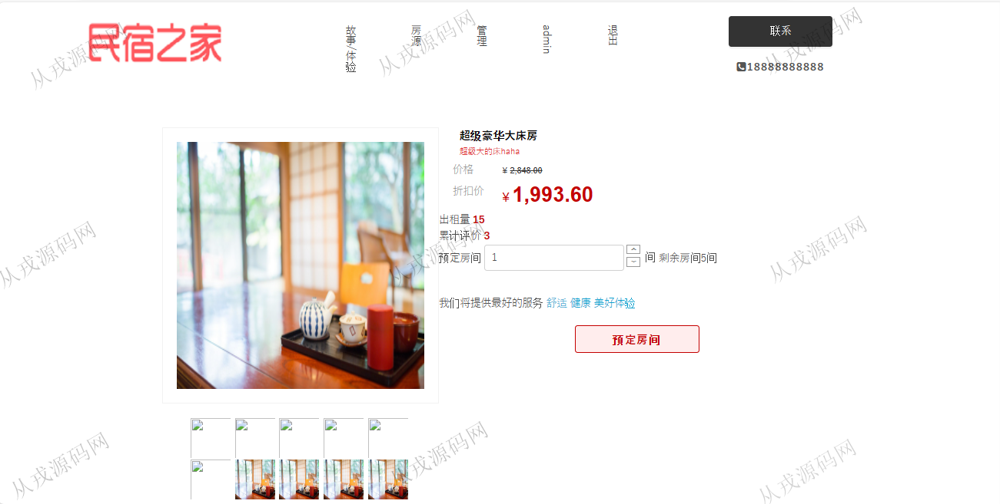

<h1 align="center">209.民宿房源管理系统</h1>

 获取sql文件 QQ: 386869957 QQ群: 377586148 

 [更多源码项目: 从戎源码网](https://armycodes.com/) 

## 简介

> 本代码来源于网络,仅供学习参考使用!
>
> 提供1.远程部署/2.修改代码/3.设计文档指导/4.框架代码讲解等服务
> 
> http://localhost:8080/
> 
> admin 123456
>

## 项目介绍
基于ssm的民宿房源管理系统：前端 jsp、jquery、bootstrap，后端 maven、springmvc、spring、mybatis；集成预定房间、房源管理、订单管理等功能于一体的系统。

## 功能介绍

- 基本功能：登录，注册，退出
- 网站首页：主导航栏，轮播图，全局搜索
- 预定房间：房间信息列表，详情，在线预订，提交订单，在线付款
- 房源管理：房源信息的增删改查，图片上传，导出
- 用户管理：用户信息的增删改查，导出
- 订单管理：订单信息的列表查询，订单编辑和删除，订单导出

## 环境

- <b>IntelliJ IDEA 2021.3</b>

- <b>Mysql 5.7.26</b>

- <b>Tomcat 7.0.73</b>

- <b>JDK 1.8</b>

## 运行截图

