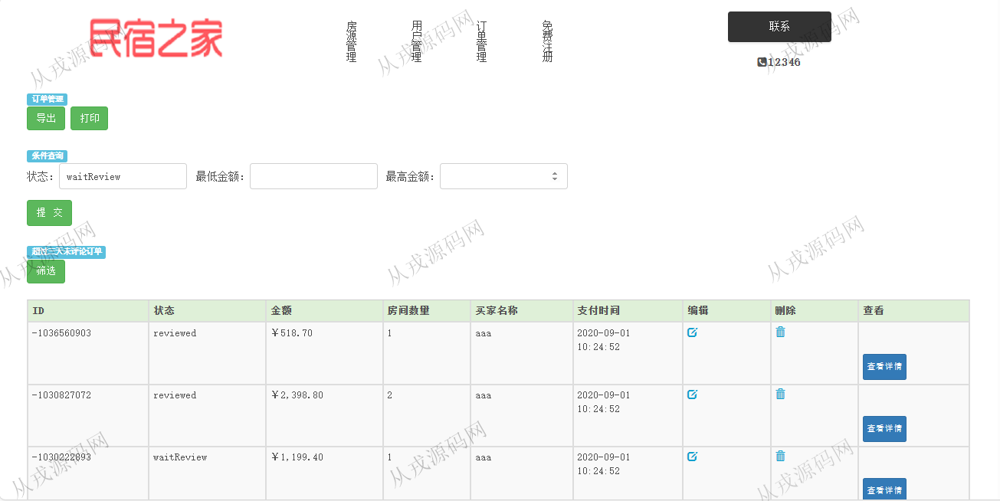

<h1 align="center">209.民宿房源管理系统</h1>

- <b>完整代码获取地址：从戎源码网 ([https://armycodes.com/](https://armycodes.com/))</b>
- <b>技术探讨、资料分享，请加QQ群：692619798</b> 
- <b>作者微信：19941326836  QQ：952045282</b> 
- <b>承接计算机毕业设计、Java毕业设计、Python毕业设计、深度学习、机器学习</b>
- <b>选题+开题报告+任务书+程序定制+安装调试+论文+答辩ppt 一条龙服务</b>
- <b>所有选题地址 ([https://github.com/YuLin-Coder/AllProjectCatalog](https://github.com/YuLin-Coder/AllProjectCatalog)) </b>

## 项目介绍
基于ssm的民宿房源管理系统：前端 jsp、jquery、bootstrap，后端 maven、springmvc、spring、mybatis；集成预定房间、房源管理、订单管理等功能于一体的系统。

## 功能介绍

- 基本功能：登录，注册，退出
- 网站首页：主导航栏，轮播图，全局搜索
- 预定房间：房间信息列表，详情，在线预订，提交订单，在线付款
- 房源管理：房源信息的增删改查，图片上传，导出
- 用户管理：用户信息的增删改查，导出
- 订单管理：订单信息的列表查询，订单编辑和删除，订单导出

## 环境

- <b>IntelliJ IDEA 2021.3</b>

- <b>Mysql 5.7.26</b>

- <b>Tomcat 7.0.73</b>

- <b>JDK 1.8</b>

## 运行截图

